### **Nama**    : **Ghina Nabila Gunawan**

### **NPM**     : **2206825914**

### **Kelas**   : **AdvProg - A**

## 📝 Performance Testing & Profiling Results

### 🚀 Test Plan Results (Before Optimization)
Sebelum melakukan _optimize code_, saya mengukur waktu respons setiap endpoint menggunakan **Apache JMeter**. Berikut hasilnya:

### 1. Test Plan 1 - `/all-student`
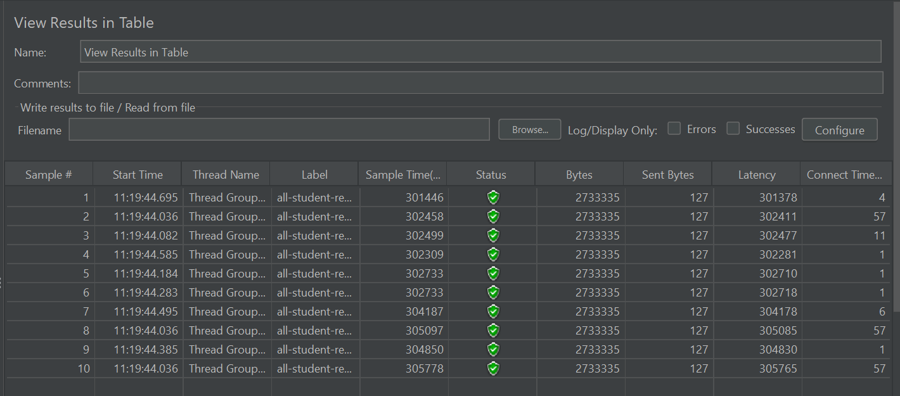

### 2. Test Plan 2 - `/all-student-name`
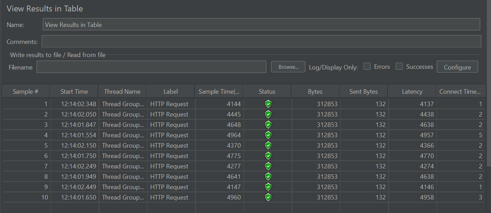

### 3. Test Plan 3 - `/highest-gpa`
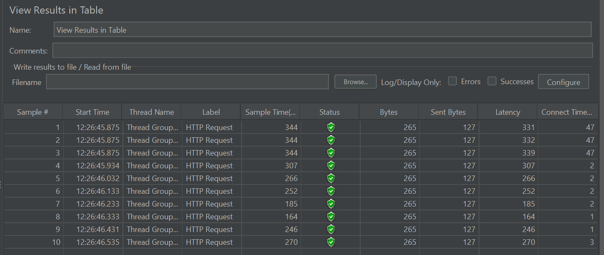

### Performance Testing Results (Command Line)

### 1. Test Plan 1 - `/all-student`
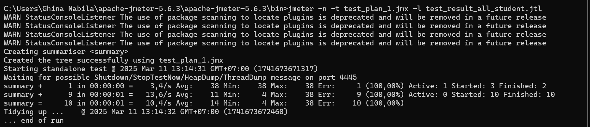
.png)

### 2. Test Plan 2 - `/all-student-name`
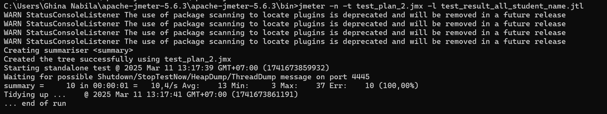
.png)

### 3. Test Plan 3 - `/highest-gpa`
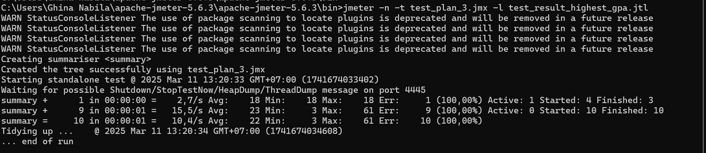
.png)

---

### 🔍 Optimization Strategy
### ✅ Profiling & Bottleneck Identification
Hasil analisis menggunakan **IntelliJ Profiler** :
- **Method `getAllStudentsWithCourses()`** punya CPU time paling tinggi karena melakukan banyak query ke database dalam loop (**N+1 Problem**).
- **Method `joinStudentNames()`** kurang optimal karena menggunakan string concatenation yang berulang.
- **Method `findStudentWithHighestGpa()`** melakukan iterasi terhadap semua data mahasiswa tanpa memanfaatkan query database secara efisien.

### 🔧 Applied Optimizations
- **Menggunakan JOIN FETCH di JPA Queries** untuk mengatasi **N+1 Problem** dan mengurangi jumlah query yang dieksekusi.
- Mengoptimalkan pemrosesan string dengan **`Collectors.joining(", ")`** untuk menghindari overhead dari string concatenation.
- Menggunakan (`@Query` di repository) supaya filtering dan sorting dilakukan langsung oleh database, bukan di dalam code Java.

---

### 🚀 Test Plan Results (After Optimization)
Setelah _optimization code_ dilakukan, saya menjalankan ulang _testing_ dengan **Apache JMeter** untuk melihat peningkatan performa.

### 1. Test Plan 1 - `/all-student` (After Optimization)
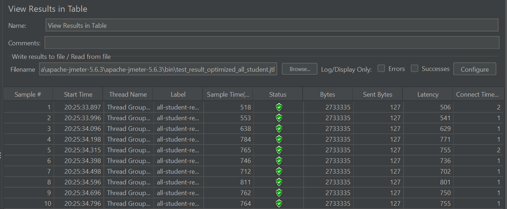

### 2. Test Plan 2 - `/all-student-name` (After Optimization)
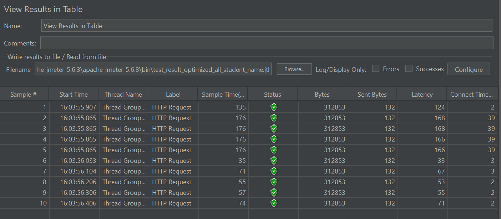

### 3. Test Plan 3 - `/highest-gpa` (After Optimization)
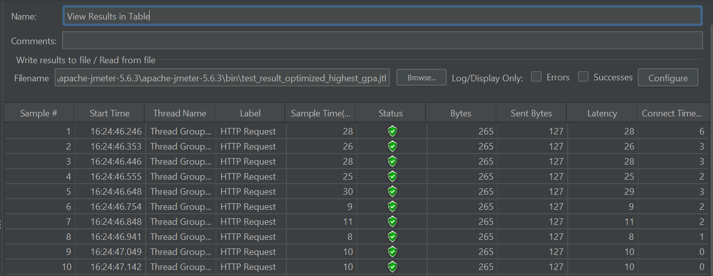

### Performance Testing Results (Command Line)

### 1. Test Plan 1 - `/all-student` (After Optimization)
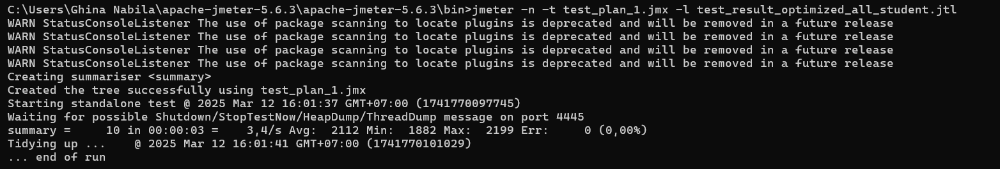
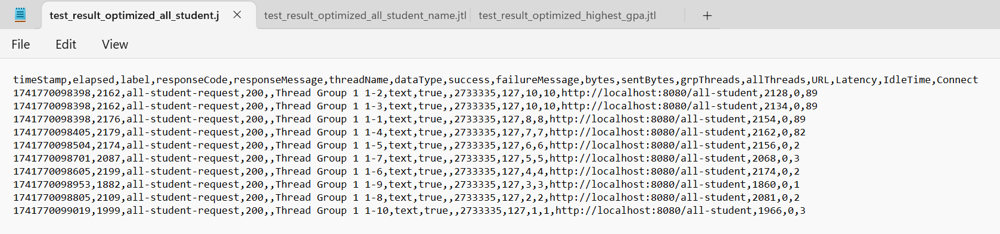

### 2. Test Plan 2 - `/all-student-name` (After Optimization)
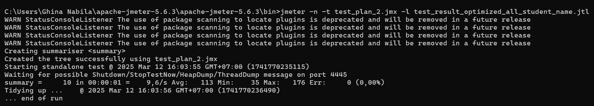
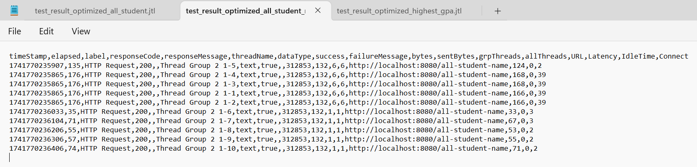

### 3. Test Plan 3 - `/highest-gpa` (After Optimization)
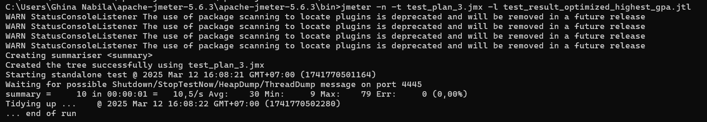
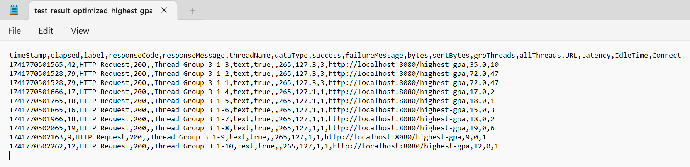

---

### 📈 Perbandingan Sebelum & Sesudah Optimasi
| Endpoint            | Sebelum Optimasi (ms) | Setelah Optimasi (ms) |
|---------------------|-----------------------|-----------------------|
| `/all-student`      | ~301,446 - 305,778    | ~518 - 811            |
| `/all-student-name` | ~4,144 - 4,964        | ~35 - 176             |
| `/highest-gpa`      | ~164 - 344 ms         | ~8 - 30               |

✅ **Target optimization > 20% berhasil dicapai di semua endpoint ^_^**

---

## 📝 Reflection 

#### 1️⃣ What is the difference between the approach of performance testing with JMeter and profiling with IntelliJ Profiler in the context of optimizing application performance?
> Performance testing dengan **JMeter** lebih fokus pada **load testing simulation**, mengukur bagaimana app merespons ketika banyak request dikirim bersamaan. Ini membantu saya memahami **response time, throughput, dan latency**, serta mendeteksi bottleneck dari external side app.  
Selain itu, **profiling dengan IntelliJ Profiler** bekerja di code level, menganalisis **CPU usage, memory allocation**, dan mengevaluasi efisiensi method dalam aplikasi.  
JMeter menjawab **"apa yang terjadi?"** sedangkan Profiler menjawab **"kenapa itu terjadi?"**.

#### 2️⃣ How does the profiling process help you in identifying and understanding the weak points in your application?
> Profiling menampilkan presisi bagian mana dari app yang **paling banyak menggunakan resources**.  
Contohnya, method `getAllStudentsWithCourses()` terdeteksi **boros CPU time** karena mengalami **N+1 Query Problem**, di mana setiap iterasi student menyebabkan query tambahan ke database.  
Dengan **flame graph, call tree, dan method list**, saya bisa pinpoint root cause masalah performa dan mengoptimalkannya dengan **JOIN FETCH**.  

#### 3️⃣ Do you think IntelliJ Profiler is effective in assisting you to analyze and identify bottlenecks in your application code?
> ✅ **Sangat efektif**, karena IntelliJ Profiler memberikan visualisasi bagaimana CPU dan memory digunakan secara **real-time**, jadi saya bisa mendeteksi bottleneck dengan cepat.  
🔹 **Flame graph** memudahkan melihat method yang paling boros resource.  
🔹 **Method list** membantu menganalisis execution time tiap method.  
🔹 **Timeline view** menampilkan CPU spikes dan method yang over-executing.  

#### 4️⃣ What are the main challenges you face when conducting performance testing and profiling, and how do you overcome these challenges?
> 🚧 Variasi hasil evaluasi performa karena pengaruh **JVM Just-In-Time (JIT) Compilation**. Saat aplikasi pertama kali dijalankan, code belum dioptimasi oleh JIT, jadi lebih lama dibandingkan setelah beberapa kali eksekusi.  
🚧 **N+1 Query Problem**, yang tidak langsung terlihat di JMeter tapi terdeteksi di Profiler. Jadi saya menggunakan **JOIN FETCH** supaya database tidak ada repeated queries.  

#### 5️⃣ What are the main benefits you gain from using IntelliJ Profiler for profiling your application code?
> - Deteksi bottleneck dengan cepat untuk melihat method yang paling boros CPU. 
> - Query Optimization untuk menganalisis apakah ada query yang tidak optimal. 
> - Membandingkan performa sebelum dan sesudah optimasi.
> - Memastikan efisiensi CPU & Memory.

#### 6️⃣ How do you handle situations where the results from profiling with IntelliJ Profiler are not entirely consistent with findings from performance testing using JMeter?
> Kadang, hasil **CPU time di Profiler** menunjukkan peningkatan, tapi **response time di JMeter masih tetap tinggi**. Hal ini bisa disebabkan oleh beberapa faktor, 
seperti **network latency atau server overload**, **database bottleneck yang terjadi di luar code aplikasi**, atau **overhead dari sistem eksternal lainnya** yang memengaruhi 
waktu respons secara keseluruhan.  

> 🎯 **Solusi yang saya lakukan biasanya sebagai berikut:**
> - Cross-validation antara hasil JMeter & Profiler.
> - Pastikan database & server stabil sebelum testing.
> - Gunakan profiling untuk isolate masalah spesifik dalam code.

#### 7️⃣ What strategies do you implement in optimizing application code after analyzing results from performance testing and profiling? How do you ensure the changes you make do not affect the application's functionality??
> 🎯 **Optimizing yang saya lakukan:**
> - Database Query Optimization: Menggunakan **JOIN FETCH** untuk menghilangkan N+1 Query Problem.
> - Java Stream API Optimization: Mengubah loop manual ke **stream processing** supaya lebih efisien.
> - Avoiding Unnecessary Object Creation: Menggunakan **Collectors.joining()** untuk penggabungan string.
> - Utilizing Database Indexing: Memastikan query filtering lebih cepat dengan indexing di database.
> - Refactoring Code untuk Reduce CPU Time: Mengambil hanya field yang diperlukan untuk mengurangi beban app.

> ✅ **Cara saya memastikan tidak merusak application's functionality:**
> - Unit Testing & Integration Testing setelah setiap perubahan.
> - Regression Testing dengan Postman untuk memastikan response API tetap valid.
> - Membandingkan hasil JMeter sebelum dan sesudah optimasi untuk memastikan >= **20% peningkatan performa**.
> - Profiling ulang dengan IntelliJ Profiler untuk melihat dampak optimasi pada CPU Time & query execution.

---
