# Performance Testing & Profiling Results

## 🚀 Test Plan Results (Before Optimization)

### 1. Test Plan 1 - `/all-student-request`
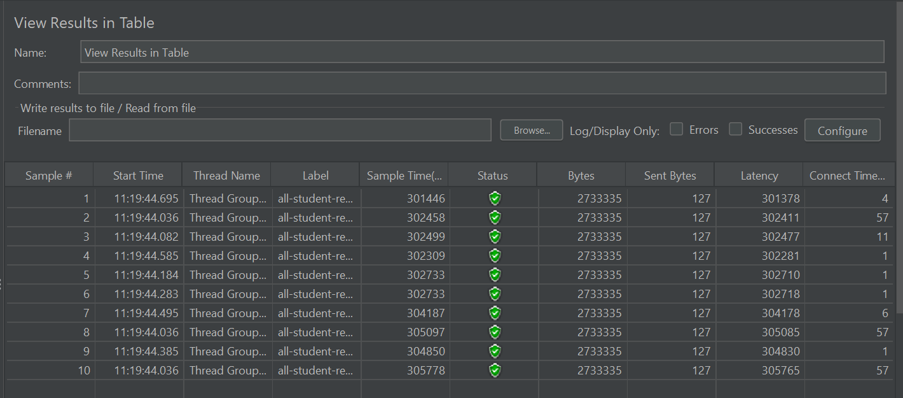

### 2. Test Plan 2 - `/all-student-name`
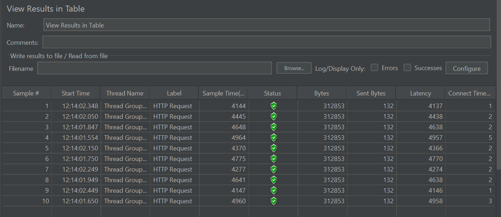

### 3. Test Plan 3 - `/highest-gpa`
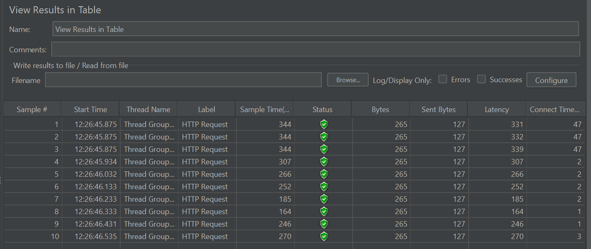

### Performance Testing Results (Command Line)

### 1. Test Plan 1 - `/all-student-request`
.png)
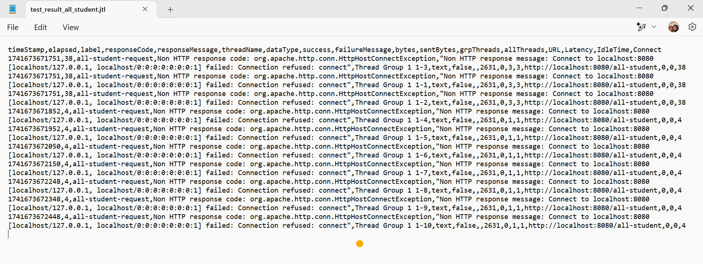

### 2. Test Plan 2 - `/all-student-name`
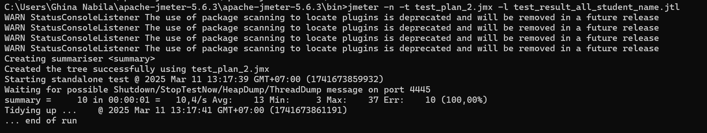
.png)

### 3. Test Plan 3 - `/highest-gpa`
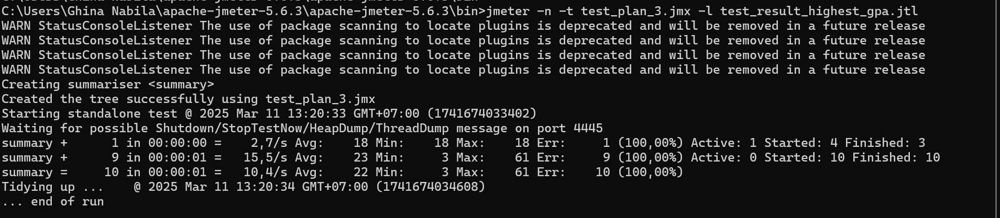
.png)

---

## 🔍 Optimization Strategy
### ✅ Profiling & Bottleneck Identification
Hasil analisis menggunakan **IntelliJ Profiler** :
- **Method `getAllStudentsWithCourses()`** punya CPU time paling tinggi karena melakukan banyak query ke database dalam loop (**N+1 Problem**).
- **Method `joinStudentNames()`** kurang optimal karena menggunakan string concatenation yang berulang.
- **Method `findStudentWithHighestGpa()`** melakukan iterasi terhadap semua data mahasiswa tanpa memanfaatkan query database secara efisien.

### 🔧 Applied Optimizations
- **Menggunakan JOIN FETCH di JPA Queries** untuk mengatasi **N+1 Problem** dan mengurangi jumlah query yang dieksekusi.
- Mengoptimalkan pemrosesan string dengan **`Collectors.joining(", ")`** untuk menghindari overhead dari string concatenation.
- Menggunakan (`@Query` di repository) supaya filtering dan sorting dilakukan langsung oleh database, bukan di dalam kode Java.

---

## 📊 Test Plan Results (After Optimization)

### 1. Test Plan 1 - `/all-student-request` (After Optimization)
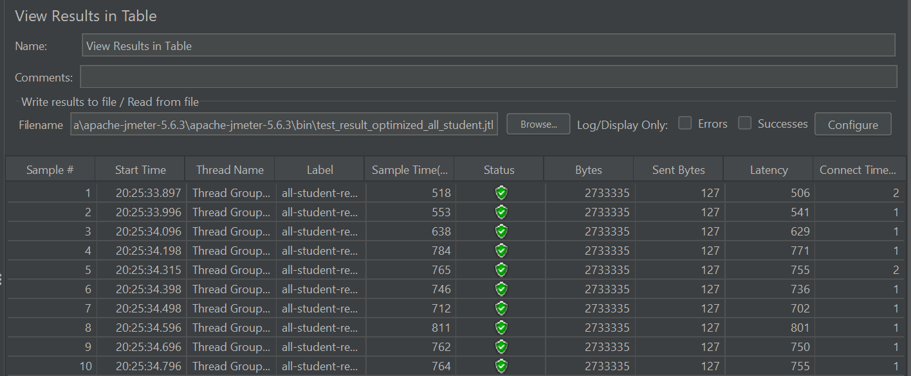

### 2. Test Plan 2 - `/all-student-name` (After Optimization)
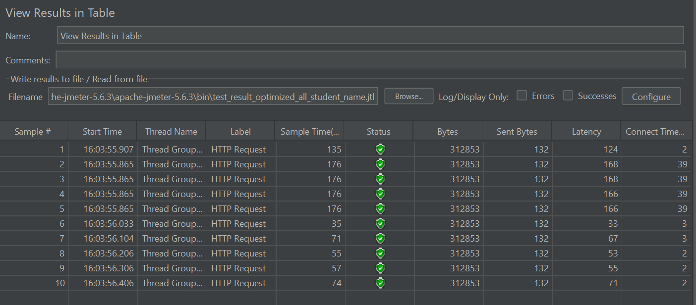

### 3. Test Plan 3 - `/highest-gpa` (After Optimization)
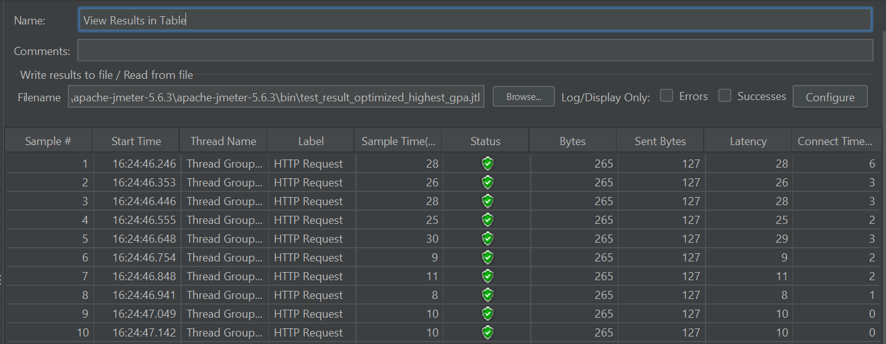

### Performance Testing Results (Command Line)
### 1. Test Plan 1 - `/all-student-request` (After Optimization)
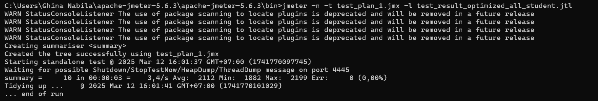
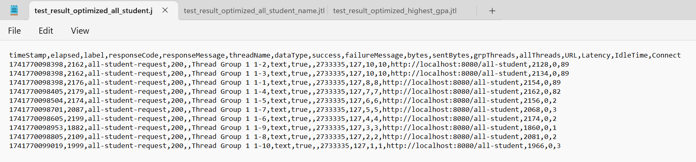

### 2. Test Plan 2 - `/all-student-name` (After Optimization)
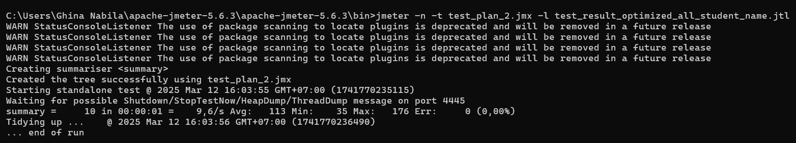
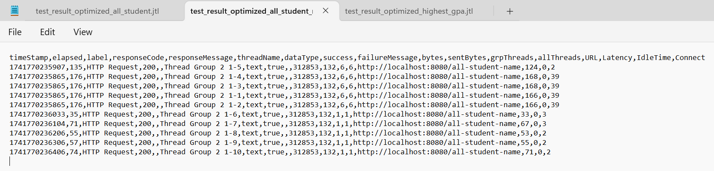

### 3. Test Plan 3 - `/highest-gpa` (After Optimization)
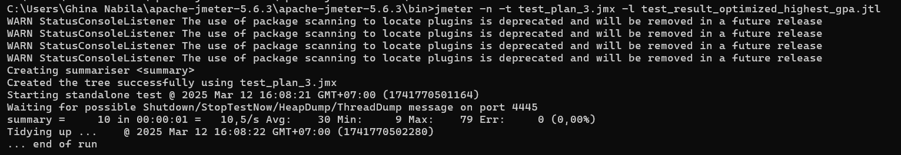
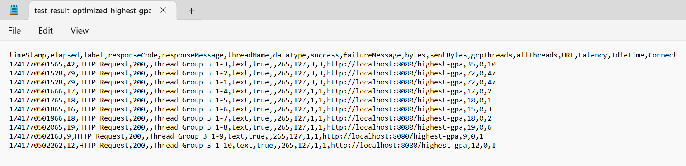

---

